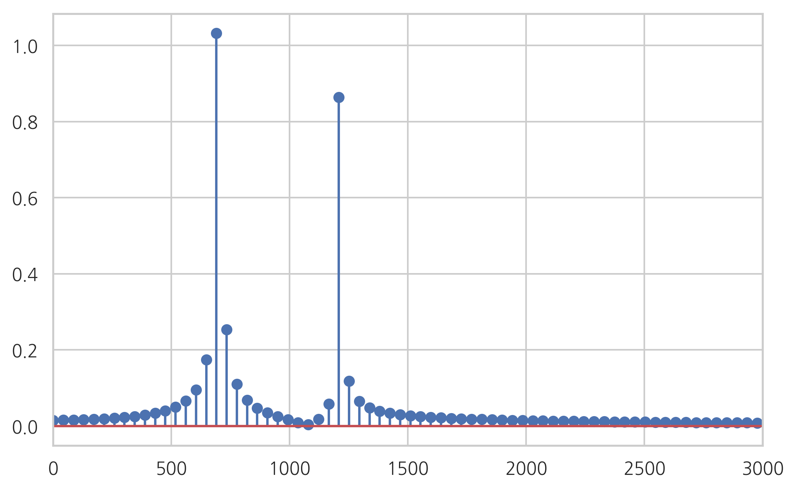
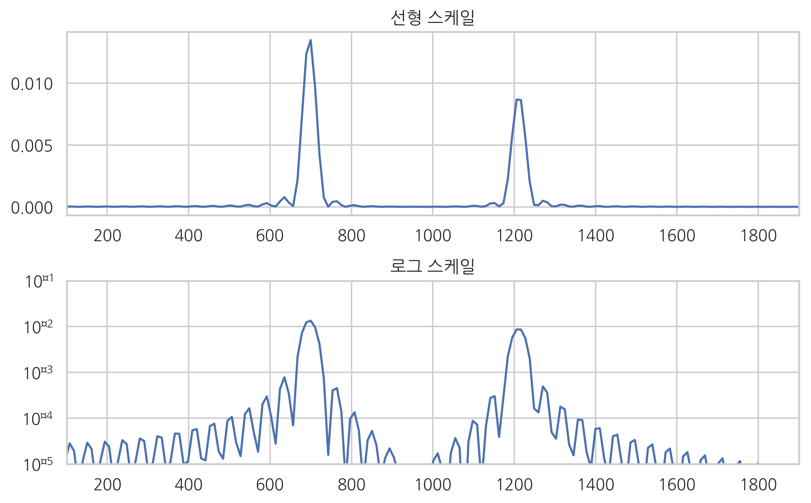
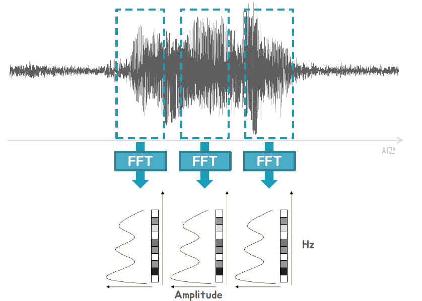

# SignalProcessing

### FT

* Fourier Transform
* 시계열데이터(빨강) -> 복수의 정현파 주파수 영역으로 변환

### FFT

* ##### Fast Fourier Transform

* 결정론적인 시계열 데이터를 주파수 영역으로 변환

* 고속 퓨리에 변환은 아주 적은 계산령으로 DFT(Discrete Fourier Transfrom)을 하는 알고리즘

* 길이가 2^N인 시계열에만 적용가능
* O(NlogN)계산량
* 문제점 : Gibbbs Phenomenon /  시간축 손실

### Spectrum

* called power spectrum or spectrum density
* 확률론적인 확률과정 모형을 주파수 영역으로 변환

### STFT

* ##### Short-Time Fourier Transform

* 주파수 특성이 시간데 따라 달라지는 사운드를 분석하기 위한 방법
* 시계열을 일정한 시간구간으로 나누고 각 구간에 대해 스펙트럼을 구한 데이터

### Spectrogram

* X축 : 시간(Samples)
* Y축 : 진동수(Frequency)
* Z축 : 진폭(Magnitude)

### Mel-Spectrum

- mel unit

$$
m = 2595 log(1+ \frac{f}{700})
$$

### MFCC

* Mel-frequency cepstral coeffcients
* Mel Scale Spectrum을 40개의 주파수구역(band)로 묶은뒤에 이를 다시 퓨리에 변환하여 얻은 계수

